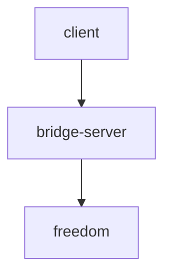

# v2ray-shadowsock-over-gost
this script create shadowsocks and v2ray on 2 mode
1) direct

in direct mode client connect to server directly without any forwarder

2) bridge

 |        client         |   =============>   |      bridge server    |   =============>     |       freedom         |

in bridge mode client connect to forwarder in local area and bridge server forward traffic as a ssh tunne to freedon server

