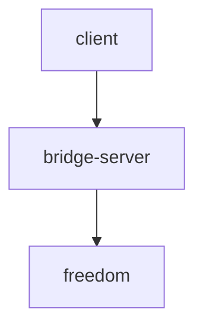

# v2ray-shadowsock-over-gost
this script create shadowsocks and v2ray on 2 mode
###  direct

in direct mode client connect to server directly without any forwarder


###  bridge
in bridge mode client connect to forwarder in local area and bridge server forward traffic as a ssh tunne to freedon server





###  RUN SCRIPT
```bash
git clone https://github.com/hoseinmontazer/proxy.git
cd proxy/
chmod +x proxy.sh
./proxy.sh
```

son2vmess.py script use from this repo https://github.com/hoseinmontazer/proxy
